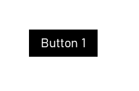
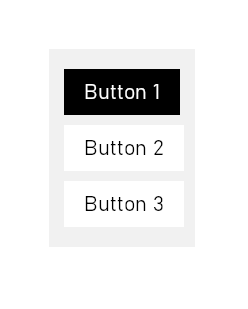

# GM UI LIBRARY<!-- omit from toc -->

- [About](#about)
- [How To Install](#how-to-install)
- [Documentation](#documentation)
  - [Code Examples](#code-examples)
  - [Objects](#objects)
    - [- obj\_gm\_ui\_element](#--obj_gm_ui_element)
      - [Methods](#methods)
      - [Variables](#variables)
    - [- obj\_gm\_ui\_button\_primary](#--obj_gm_ui_button_primary)
      - [Variables](#variables-1)
      - [Methods](#methods-1)
    - [- obj\_gm\_ui\_button\_secondary](#--obj_gm_ui_button_secondary)
      - [Variables](#variables-2)
      - [Methods](#methods-2)
    - [- obj\_gm\_ui\_vertical\_list](#--obj_gm_ui_vertical_list)
      - [Variables](#variables-3)
      - [Methods](#methods-3)
    - [- obj\_gm\_ui\_textbox](#--obj_gm_ui_textbox)
      - [Variables](#variables-4)
      - [Methods](#methods-4)
    - [- obj\_gm\_ui\_row](#--obj_gm_ui_row)
      - [Variables](#variables-5)
      - [Methods](#methods-5)
  - [Enums](#enums)
  - [Global Util Functions](#global-util-functions)

# About 
GM UI LIBRARY is a package for Game Maker 2.x including objects that can be used to easily create a dynamic interface. Game Maker 2.x currently does not have the ability to easily create an user interface. GM UI LIBRARY tries to make that process easier. Anyone and everyone is invited to contribute to this project.
# How To Install
Go to [Releases](https://github.com/greenpixels/game-maker-ui-library/releases) and download the latest package.
In your Game Maker 2 Project, open the 'TOOLS'-context-menu on the top and import this package into your project.
# Documentation
## Code Examples

In this code example we create a simple button and change its left and right padding:
```gml
// This will create a button instance on the specified coordinates
button = instance_create_depth(50, 50, depth, obj_gm_ui_button);
button.padding_left = 15;
button.padding_right = 15;
// While under the hood these padding-changes are applied, we need to update this element in order for layouting to take effect
// (This applies for every change that affects layouting)
button.update();
```



In this code-example we create a vertical list and add three buttons:
```gml
list1 = instance_create_depth(50, 50, depth, obj_gm_ui_vertical_list);
button1 = instance_create_depth(0, 0, depth, obj_gm_ui_button_primary ); // x and y don't matter here since we will add these elements as childs and the parent will re-position them anyways
button1.text_content = "Button 1";
button1.add_event_callback(UI_EVENT.ON_MOUSE_RELEASED, function() {
  // This will get executed when the left mouse button is released on this element
	show_message("You have clicked this button!");
});
button2 = instance_create_depth(0, 0, depth, obj_gm_ui_button_secondary);
button2.text_content = "Button 2";
button3 = instance_create_depth(0, 0, depth, obj_gm_ui_button_secondary);
button3.text_content = "Button 3";
// Under the hood 'add_childs' already updates all components involved in this, so we don't need to trigger an update ourselves
list1.add_childs([button1, button2, button3])
```



[You can find a web-demo showcasing the basic functionality of this project on itch.io](https://greenpixels.itch.io/game-maker-ui-library)
## Objects
### - obj_gm_ui_element
This is the template object of this project. This object can be extended by setting it as a parent to easily create your own custom UI elements.
#### Methods

##### Public Methods<!-- omit from toc -->
| Name | Return Value |Description|
|---|---|---|
|add_child(obj_gm_ui_element)|void|Declares an element as a child of this element. Updates this element and all its children|
|add_childs(Array<obj_gm_ui_element>)|void|Declares each entry of an array of elements as a child of this element. Updates this element and all its children|
|add_event_callback(EVENT_TYPE, Function)|void|Adds a function to the event-map, which will get executed when the defined event is triggered|
|execute_event_callback(EVENT_TYPE)|void|Executes all functions in the event-map for the defined event and gives itself as the first parameter|
|mouse_in_element()|void| Checks whether the mouse is inside the current element and all of its parents and returns the result|
|set_padding(amount)|void| Sets the padding for all sides|
|set_margin(amount)|void| Sets the margin for all sides|
|set_visibility(boolean)|void| Sets whether the element is hidden or not. Triggers a redraw for self and all children|

##### Methods That Should Be Handled As Private<!-- omit from toc -->
| Name | Return Value |Description|
|---|---|---|
|validate_surface()|void|Checks whether the surface does not exist or its dimensions are not equal to the elements dimensions then it creates or resizes accordingly and triggers a redraw|
|check_max_width_exceeded(width: real)|bool|Returns whether adding the width to the current elements width would exceed the maximum width specified. If no maximum width is specified the functions always returns false.|
|layout_children()|void|Layouts the children of this element and extends its width and height when necessary|
|layout_text()|void|Layouts the text according to the set text variables in the element|
|paint()|void|Paints self and all children|
|update()|void|Layouts the children and text, updates the dimension and triggers a redraw.|

#### Variables
##### Variables For Text Manipulation:<!-- omit from toc -->
| Name | Type |Description|
|---|---|---|
|text_content|String|The string that is rendered on the element|
|text_font|Asset<Font>|The font that is used to render the text|
|text_color|Color|The color of the text|
|text_scale|Color|The scale of the text|
|||
|text_halign|fa_halign|The horizontal alignment of the text. This sets the horizontal position of the text|
|text_vertical|fa_valign|The vertical alignment of the text|
|||
|text_x_offset|Real|The horizontal offset of the text|
|text_y_offset|Real|The vertical offset of the text|
|||
|text_overflow|TEXT_OVERFLOW|The handling of overflow. HIDE cuts the text off when overflowing, EXTENDS resizes the element to fit the text|

##### Variables For Layout Manipulation:<!-- omit from toc -->
| Name | Type |Description|
|---|---|---|
|min_width|Real|The minimal width of the element|
|min_height|Real|The minmal height of the element|
|max_width|Real|The maximum width of the element|
|max_height|Real|The maximum height of the element|
|||
|margin_top|Real|The top margin to other elements in the same parent|
|margin_right|Real|The right margin to other elements in the same parent|
|margin_bottom|Real|The bottom margin to other elements in the same parent|
|margin_left|Real|The left margin to other elements in the same parent|
|||
|padding_top|Real|The top padding|
|padding_right|Real|The right padding| 
|padding_bottom|Real|The bottom padding|
|padding_left|Real|The left padding|
|||
|flex_direction|UI_FLEX_DIRECTION|The direction of the placement of elements|

##### Variables For Image Manipulation:<!-- omit from toc -->
| Name | Type |Description|
|---|---|---|
|bg_image|Asset<Sprite>|The background image of the element. Will be rendered behind the text and in front of the background color|
|image_fit|IMAGE_FIT|The method used to fit the background image to the element|
|||
|bg_color|Color|The background color of the element|
|bg_alpha|Real|The alpha value of the background color|

##### Misc. Variables:<!-- omit from toc -->
| Name | Type |Description|
|---|---|---|
|outline_color|Color|The color of the outlines|
|outline_top_strength|real|The width of the top outline|
|outline_right_strength|real|The width of the right outline|
|outline_bottom_strength|real|The width of the bottom outline|
|outline_left_strength|real|The width of the left outline|
|||
|brightness|Real|The brightness of the element from -1 to 1|
|rotation|Real|The rotation of the element. Does not affect layout|
|disabled|Boolean|Prevents interaction with this element|
|x_scale|Real|The horizontal scale of the element. Does not affect layout and does not change the width variable|
|y_scale|Real|The vertical scale of the element. Does not affect layout and does not change the height variable|
|event_callback|Map<UI_EVENT, Function>|The map with functions executed when specific events are triggered|

##### Variables That Should Mostly Be Handled As Read-Only<!-- omit from toc -->
| Name | Type |Description|
|---|---|---|
|hidden|Boolean|Whether the element is visible|
|redraw_in_next_frame|bool|Triggers a redraw to the surface in the next frame when true|
|hovered|bool|Whether the mouse cursor is inside all parent elements and the element itself|
|parent|obj_gm_ui_element|The parent of the element and of whose surface this element is drawn on|
|children|obj_gm_ui_element|The children of this element that are drawn on this elements surface|
|width|Real|The computed width of this element|
|height|Real|The computed height of this element|
|room_x|Real|The horizontal position of this element inside the room, as the built-in x variable reflects the relative horizontal position on the parent surface|
|room_y|Real|The vertical position of this element inside the room, as the built-in y variable reflects the relative vertical position on the parent surface|
|text_width|Real|The calculcated width of this elements text|
|text_height|Real|The calculated height of this elements text|
|surface|Real|The ID of this elements surface|

### - obj_gm_ui_button_primary
Extends obj_gm_ui_element and adds functionality to act like a button.
#### Variables
No additional variables were added
#### Methods
No additional methods were added

### - obj_gm_ui_button_secondary
Extends obj_gm_ui_element and adds functionality to act like a button.
#### Variables
No additional variables were added
#### Methods
No additional methods were added

### - obj_gm_ui_vertical_list
Extends obj_gm_ui_element and sets variables to act like a vertical list.

#### Variables
No additional variables were added
#### Methods
No additional methods were added

### - obj_gm_ui_textbox
Extends obj_gm_ui_element and sets variables to act like a textbox.

#### Variables
No additional variables were added
#### Methods
No additional methods were added

### - obj_gm_ui_row
Extends obj_gm_ui_element and sets variables to act like a row element.

#### Variables
No additional variables were added
#### Methods
No additional methods were added
## Enums
Enums used in this project
|UI_FLEX_DIRECTION|
|---|
|.VERTICAL|
|.HORIZONTAL|

|UI_EVENT|
|---|
|.ON_MOUSE_ENTER|
|.ON_MOUSE_EXIT|
|.ON_MOUSE_PRESSED|
|.ON_MOUSE_RELEASED|

|UI_IMAGE_FIT|
|---|
|.SCALED|
|.STATIC|
|.KEEP_ASPECT|

|UI_TEXT_OVERFLOW|
|---|
|.EXTEND|
|.HIDE|

## Global Util Functions
| Name | Return Value |Description|
|---|---|---|
|draw_text_aligned_on_box(x, y, width, height, text, halign, valign)|void|Automatically offsets the text to the correct position with the given horizontal alignment|
|break_text(text, width)|string|Breaks the given text when exceeding the maximum width|
|draw_sprite_fitted(sprite, image_index, x, y, width, height, IMAGE_FIT|void|Resizes and draws an image with the given fitting method|